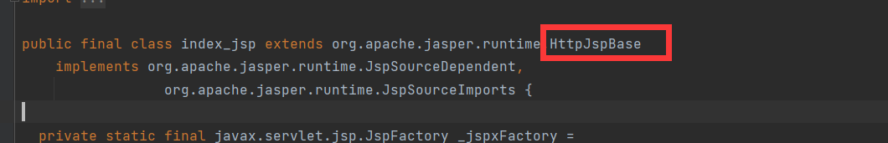
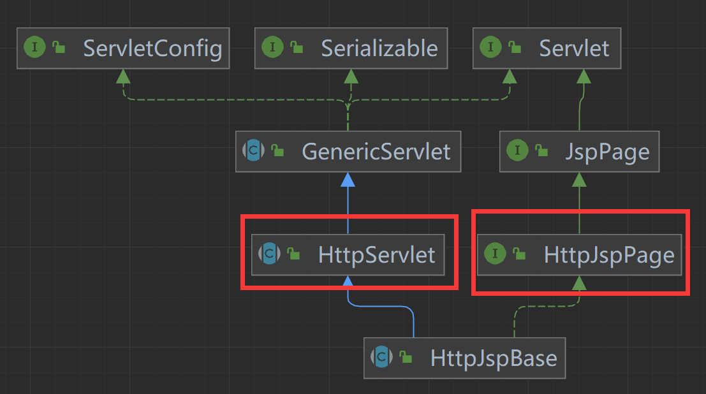
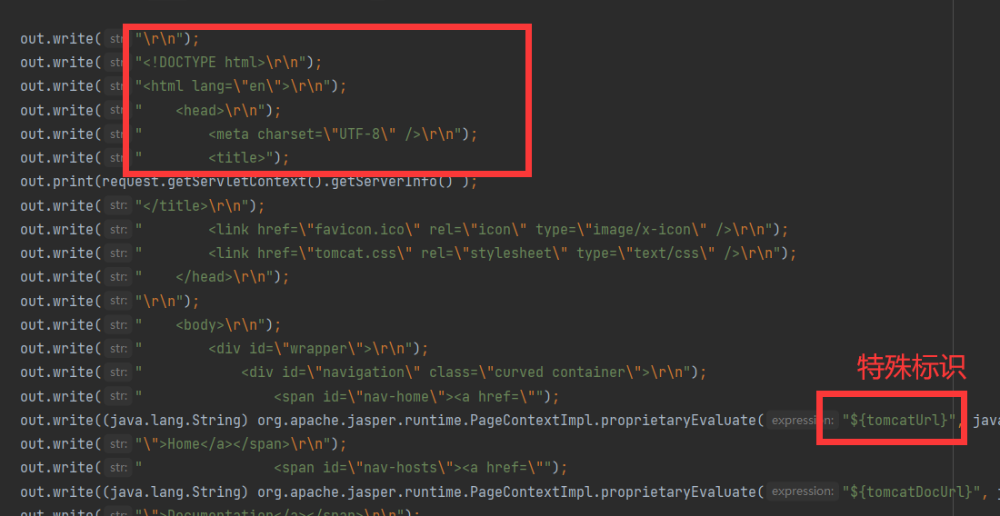
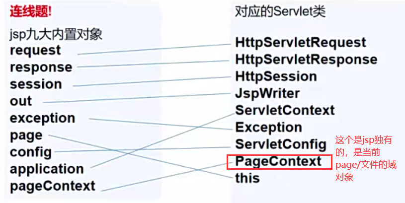

# JavaWeb

1. 网关
   1. 概念：也叫协议转换器或者网间转换器，仅用于两个高层协议不同的网络互联

2. JavaWeb三大组件：servlet，filter，listener；

3. HTTP(S)协议

   1. 个人理解：
      HTTP名为超文本传输协议；顾名思义，它是用来传输数据的，并且不单纯可以传输文本，还可以传输许多媒体文件；

      HTTP常见的状态码：200，302，304，404，500(服务器错误)；

      1. 302：服务器重定向；当一个请求被服务器重定向之后(也就是把这个请求转给了另外的服务器)，会返回302错误码，同时会在响应头添加一个location 当服务端接收时，会立刻根据location的标识符发起新请求。
      2. 304：资源请求未修改，不返回数据；这个和Last-Modified响应头有关，可以参考下面内容；

      HTTP分为请求和响应两者数据表现；请求由客户端发起，响应由服务器返回；
      HTTP请求内容如下：

      ```http
      GET /Servlet/login1.html HTTP/1.1 # 请求行 显示了请求方法，以及资源定位
      Host: localhost:8080 # 主机名
      User-Agent: Mozilla/5.0 (Windows NT 10.0; Win64; x64; rv:109.0) Gecko/20100101 Firefox/116.0 #客户端的自身信息
      Accept: text/html,application/xhtml+xml,application/xml;q=0.9,image/avif,image/webp,*/*;q=0.8 # 这里表示客服端可以接受的数据格式 
      // MIMI数据类型是浏览器特有数据格式 形式为 text/html  
      Accept-Language: zh-CN,zh;q=0.8,zh-TW;q=0.7,zh-HK;q=0.5,en-US;q=0.3,en;q=0.2
      Accept-Encoding: gzip, deflate, br 
      #这里是客户端可以接受的压缩算法 一般的数据再发送回来的时候服务器都会进行压缩 提高效率
      Connection: keep-alive # 告诉服务器 连接状态为保持连接
      Cookie: JSESSIONID=C93CBFA4236FA4606634BF2674B6F82D #服务器用来检验用户身份信息一种方式
      Referer:http://localhost/Servlet/login1.html #当前请求是从那个界面发起的
      Upgrade-Insecure-Requests: 1
      Sec-Fetch-Dest: document
      Sec-Fetch-Mode: navigate
      Sec-Fetch-Site: none
      Sec-Fetch-User: ?1
      Pragma: no-cache
      Cache-Control: no-cache
      ```

      HTTP响应内容：

      ```http
      //相应行
      HTTP/1.1 200 
      //响应头
      Accept-Ranges: bytes #客户端可以接受的数据传输形式 bytes表示按字节发送数据
      ETag: W/"312-1695548180929"
      Last-Modified: Sun, 24 Sep 2023 09:36:20 GMT #用于标记该响应体上一次修改的时间 
      ##如果客户端有缓存 下一次请求时请求头会携带它 如果服务器该文件未发生改变 即修改时间一致 服务器会直接返回304错误码 如没有缓存 就不会携带 
      Content-Type: text/html
      Content-Length: 312 #这个表示响应体的长度 客户端需要它来校验收到的响应体是否完整
      Date: Sun, 24 Sep 2023 10:12:40 GMT
      Keep-Alive: timeout=20
      Connection: keep-alive
      ### 这里有一个空行
      //响应体
      <!DOCTYPE html>
      <html lang="en">
      <head>
          <meta charset="UTF-8">
          <title>login</title>
      </head>
      <body>
      	<p>login</p>
      </body>
      </html>
      ```

4. 重定向与转发

   1. 转发：当浏览器发起请求到服务器的某个Servlet（该Servlet解析后，发现这个请求是另一个Servlet处理的，客户端发错了），该Servlet再将该请求发送给服务器的应一个Servlet处理并返回数据给客户端；

   2. 重定向：客户端发请求，服务端根据解析请求，交给Servlet处理，Servlet返回302错误码，并添加一个新的请求url到响应头( location-url )，客户端根据这个url再次发起请求，最总得到数据；

      从基本定义看出，转发是发生在**服务器内部的，客户端感觉不到，客户端只发起了一次请求**，重定向**两端都有参与，总共发起两次请求**；

      代码实现：

      ```java
      //请求转发 
      //转发前后的servlet中req对象是同一个对象
      req.getRequestDispatcher("/views/view/user.jsp").forward(req,resp);
      //请求重定向
      resp.sendRedirect("/views/view/user.jsp");
      //重定向到一个Servlet
      resp.sendRedirect("/cat");
      ```

      

5. 会话机制

   1. 会话：
      个人理解：HTTP本身是一个无状态的请求，为了弥补这个问题，就引入了会话机制，用来记录用户的状态；会话就是**一个客户端从访问某个服务器的一个或多个web资源到客户端关闭这些资源的整个过程**就称为会话；当后发出的请求需要前一个请求返回的数据或者状态时（比如访问管理个人信息，就需要先发起登录请求），之前的请求就会与服务器建立一个会话，服务器会生成一个sessionId并返回，当客户端再次请求时，就会携带这个id到请求头，以便服务器识别用户状态。

   2. Cookie和Session
      前面提到的HTTP请求采用会话机制来记录用户状态；具体实现就依赖于Cookie和Seesion；

      ***Cookie***
      	其本质上是一个数据结构，类似hashmap的k-v键值对结构，只不过k-v的数据类型是String，**它是由服务器生成，发送到客户端，客户端进行保存**，当客户端**发送该域请求时**会自动携带到请求头，并以 Set-Cookie - value的形式封装；它可以用来保存一些轻量级的数据（一般都是标识用户的一些关键信息，比如userid，登陆状态），上面提到的 JSESSIONID-sessionId 就是通过它来保存的；**Cookie是有生命周期的，超过生命周期，浏览器不会携带，在某个时间内自动删除**（就比如，你进入一个页面很长时间没操作，再次进入要你重新登陆，这个就是Cooike过期了，浏览器重新发送了请求）；

      ***Seesion***
      	它也是一个数据结构，类似于map的结构；**它是保存在服务端**，通过cookie进行传输，在cookie中用**JSESSIONID**作为key；它是用来标识用户状态和信息的，虽然cookie也可以实现，不过限于cookie容量以及安全性问题，就使用了seesion；其基本原理是客户端通过返回一个sessionId（服务器生成），服务端根据sessionId查找对应的session对象，session对象记录了客户端的行为和信息；在本次会话结束后，服务器会在某个时间段释放失效的session对象；**Session默认生命周期30分钟**，它的生命周期计算和cookie有所不同，它**是两次访问的最大间隔时间是30min**，服务端会有一个专门管理的session的线程，会轮询检查并释放；

      具体过程：①客户端发送请求，服务端检查其cookie是否携带key值为JSESSIONID，如果携带，则通过id去session表中查找，如果找到，直接操作（这个响应头不会返回JSID）；②如果没有携带，则直接创建一个session对象（**前提是调用了创建session对象的api，getSession()**），并把该id返回；③ 如果携带但表不存在该id（就比如原来的session关闭了/生命周期过了），则重新创建一个session对象，并返回该id；

      两者区别

      ​	最明显的是**Cookie在客户端，session在服务端**，session的传递依附于cookie；两者都有时效性，过期失效；**Session比cookie更安全，存储的数据更丰富也更大，cookie只能存字符串**；

6. 服务器渲染技术Jsp

   1. Jsp 全称Java Server Page；

   2. 它的出现就是为了解决servlet不方便实现动态页面；

   3. 基本原理：

      当jsp文件被访问时，tomcat会解析jsp，将jsp文件编译成.class文件和.java文件（这个文件在tomcat目录的work目录文件下）；打开.class字节码文件可以看到，生成的文件继承自HttpJspBese，打开该类类图，继承HttpServlet并实现了接口HttpJspPage；

      

      

      也就是jsp实质上就是一个servlet程序；查看sevce()方法的实现可以看到，它也就是将html文件写入到respone中，并使用一些特有占位符，添加数据；

      

   4. 书写格式

      ```jsp
           /有三种书写格式
              //1. <% java代码 %>  代码脚本片段
              
              //2. <%=java代码%> 这个会把=后面的运行结果直接在浏览器页面显示出来 与		 out.print()或out.write()作用相同
              
              //3. <%@指令名 属性1=属性值1 属性2=属性值2 ....%> 这个是jsp指令,三个常用指令 <%@ page %> ，<%@ include %> ，| <%@ taglib %>
              
              //4. <%! %> 声明成员变量，方法，静态代码块，内部类 
              
              //演示
              <body>
                  <%@ page contentType="text/html;charset=UTF-8" language="java" %>
                  //设置页面的属性
                  <%
                      String method = request.getMethod();
                      out.println("页面的请求方法为:"+method);
                  %> //获取请求方法，并输出页面
                  <%=request.getMethod()%> //获取请求方法，并输出页面
              </body>
      ```

   5. Jsp九个预置对象

         大部分的预置对象都来自于servlet

         示意图：
         

   6. Jsp四个域对象
        域对象：在某个作用范围内的对象，主要是为了实现数据存取；
        **pageContext**（当前页面有效），**session域对象**（当前会话期间有效），**application**（整个web应用程序运行期间有效，类似于servletContext），**request**（一次请求内有效）；

   7. 特别说明：Jsp文件不可以直接被浏览器解析，需要通过tomcat解析生成.class字节码和.java文件；

   8. 参考：[JSP入门-CSDN博客](https://blog.csdn.net/weixin_45905210/article/details/121483729)


   2. EL和JSTP

      1. 这两个表达式都是为了简化jsp

      2. 语法：

         ```jsp
         EL : ${代码块}
         JSTP: <c:操作 属性1="值1" 属性2="值2">操作对象</c:操作>
         ```

      3. 特别说明：EL里面有许多预置对象，和jsp的大值相同，可以直接使用；

      4. 代码演示

         ```jsp
         //这个是JSTP的表达式 可用于循环获取
         <c:forEach items="${requestScope.monsters}" var="monster">
             //JSTP的if判断 如果满足 就会执行<td>${monster.id}</td>
             <c:if test="${attribute==monster.id}">
                 <td>${monster.id}</td>
             </c:if>
             <tr>
                 //${key} 这个的功能类似req.getAttribute("key") 这个是EL表达式的语法 {}里面是java代码块 类似<%%>
                 <td>${monster.id}</td>
                 <td>${monster.name}</td>
                 <td>${monster.age}</td>
             </tr>
         </c:forEach>
         //这个类似于req.setAttribute("name")
         //scope 属性指定存储的域对象
          <c:set scope="request" var="name" value="李大锤"></c:set>
         ```

   3. JavaWeb监听技术

   1. 事件监听：对目标（事件源）进行的某个操作产生的事件进行监听（监听器）；

   2. 基本原理：目标持有并绑定监听器，在监听事件处 调用监听器的api触发事件；

   3. JavaWeb常见的三个监听器

      ```java
      HttpSessionListener;//这个监听session的创建与销毁
      ServletContextListener;//这个监听整个web应用的创建与销毁
      ServletRequestListener;//这个监听每一次的request
      //还有三个与之对应的属性监听器
      HttpSessionAttributeListener  
          
      //只要实现了这几个接口 就可以实现监听   
      ```

      添加监听器，这个需要在web.xml中配置 和servlet一样 都是通过反射获取监听器并绑定

      ```xml
      <listener>
          <listener-class>service.ContextListener</listener-class>
      </listener>
      ```

   4. Filter 过滤技术

      1. **背景**：它的出现是为了防止用户访问没有权限的资源；就比如客户没有登录，却像访问个人管理界面；虽然在对应的servlet可以加上判断（比如session），如果页面增多，就需要写重复验证，就比如验证用户登录，在managerServlet，operationServlet，selectUserServlet...这些servlet都需要添加一个验证；而Filter过滤技术就可以很巧妙的实现这个验证；

      2. **过滤过程**：客户端发起请求，tomcat解析请求，根据url判断是否有增加 filter，如果有，则调用doFilter(req,resp)，在doFilter方法里面进行检验，如果验证成功，则filterChain.dofilter放行，反之不调用；

      3. 创建流程：
      tomcat通过web.xml创建filter实列并放入容器维护，整个web只有一个该filter实列；在filter创建调用init方法，并创建一个FilterConfig对象，这里可以对filter进行配置；每当一个request发起时，tomcat就会根据url-parrten 获取指定的filter；这时调用filter.doFilter(req，resp)方法，在这个方法内进行过滤要求；放行则调用filterChain.doFilter(req，resp)；放行后这里的req和resp将继续传递到指定servlet；

      4. 具体实现，需要实现servlet.Filter接口，并在web.xml中添加过滤规范；
      代码演示：

      ```xml
      ##web.xml中配置
      <filter>
          //指定过滤器类(这个类必须实现filter接口)
          <filter-name>ManagerFilter</filter-name>
          <filter-class>com.ldc.filter.ManagerFilter</filter-class>
      </filter>
      <filter-mapping>
          <filter-name>ManagerFilter</filter-name>
          <url-pattern>/manager/*</url-pattern>
          //和servlet基本上一样的配置
          //url-pattern 这个是filter 过滤的规则 只要url匹配就会触发过滤
          // 如：/manager/manager.jsp ; /manager/image/hsp.jsp ;
      </filter-mapping>
      ```

      ManagerFilter类

      ```java
      public class ManagerFilter implements Filter {
        @Override
        public void init(FilterConfig filterConfig) throws ServletException {
            Filter.super.init(filterConfig);
            //filter的生命周期随servlet
        }
        @Override
        public void doFilter(ServletRequest servletRequest, ServletResponse servletResponse, FilterChain filterChain) throws IOException, ServletException {
            //过滤逻辑
            filterChain.doFilter(servletRequest, servletResponse);
            //只有调用这个方法 才是放行
        }
        @Override
        public void destroy() {
            Filter.super.destroy();
        }
      ```

      5. 特别说明：**请求转发不会触发过滤器；过滤器只负责过滤，不关心资源是否存在；**


